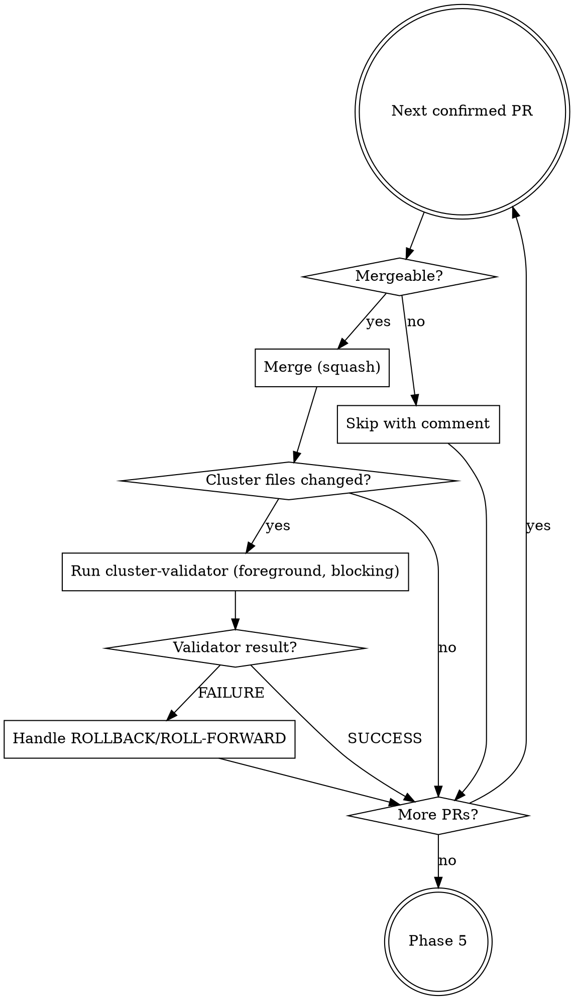

# Renovate PR Processor

## Quick Reference

| Item | Value |
|------|-------|
| Analysis agent | `renovate-pr-analyzer` (per PR, parallel) |
| Validation agent | `cluster-validator` (after each merge) |
| Merge strategy | `gh pr merge --squash` |
| Merge order | patch → minor → major → unlabeled |
| Failure handling | Auto-revert → user pushes → continue |

## Workflow

### Phase 1: DISCOVER

```bash
gh pr list --repo anthony-spruyt/spruyt-labs --author "renovate[bot]" \
  --json number,title,labels,headRefName --limit 50
```

Sort by risk: `dep/patch` → `dep/minor` → `dep/major` → no label. If none found, report and exit.

### Phase 2: ANALYZE (parallel)

Create tracking issue:

```bash
gh issue create --repo anthony-spruyt/spruyt-labs \
  --title "chore(deps): batch renovate PR processing $(date +%Y-%m-%d)" \
  --label "chore" \
  --body "$(cat <<'EOF'
## Summary
Batch processing of open Renovate dependency update PRs.

## PRs in This Batch
| PR | Title | Risk |
|----|-------|------|
| #N | <title> | patch/minor/major/unknown |

## Chore Type
Dependency management

## Affected Area
- Apps (cluster/apps/)
EOF
)"
```

Dispatch `renovate-pr-analyzer` per PR in parallel:

```
Task tool with:
  subagent_type: "renovate-pr-analyzer"
  run_in_background: true
  prompt: "Analyze Renovate PR #<number> in anthony-spruyt/spruyt-labs for breaking changes.
           GitHub issue: #<tracking-issue-number>
           Repository: anthony-spruyt/spruyt-labs"
```

Wait for all agents. Each agent output begins with `## VERDICT: [SAFE|RISKY|UNKNOWN]`. Extract `**Version Change:**`, `**Dep Type:**`, and `### Reasoning` for the Phase 3 summary table.

### Phase 3: REPORT & CONFIRM

Present summary table grouped by verdict (SAFE/RISKY/UNKNOWN) with PR number, title, version change, and reasoning. Ask user which PRs to merge. User may override any verdict.

### Phase 4: MERGE (one at a time, risk order: patch → minor → major)

**NEVER merge the next PR until the current PR's validation completes successfully.** If you batch-merge then validate, a ROLLBACK requires reverting through every PR merged after the failure. One at a time.



For each confirmed PR (one at a time):

**4.1 Merge:**
```bash
gh pr view <number> --repo anthony-spruyt/spruyt-labs --json mergeable,mergeStateStatus
gh pr merge <number> --squash --repo anthony-spruyt/spruyt-labs
```
If not mergeable (conflicts), skip with comment, continue to next PR.

**4.2 Check if cluster validation needed:**
```bash
gh pr view <number> --repo anthony-spruyt/spruyt-labs --json files --jq '.files[].path'
```
Files under `cluster/` → run cluster-validator. Only `.taskfiles/`, `docs/`, `.github/` → skip validation, continue to next PR.

**4.3 Validate** (blocking — do NOT merge next PR until this completes): `git pull --ff-only origin main`, then dispatch `cluster-validator` in **foreground** (not background) with tracking issue number, PR details, dep version change, and affected namespace/app.

**4.4 Handle result — resolve fully before next PR:**

- **SUCCESS:** Comment on tracking issue, continue to next PR.
- **ROLLBACK:**
  1. `git pull origin main && git revert HEAD --no-edit`
  2. Ask user to push the revert
  3. Re-run cluster-validator to confirm rollback
  4. **Record correction**: If misdiagnosed, append to `.claude/agent-memory/cluster-validator/known-patterns.md`. Commit: `fix(agents): update cluster-validator patterns from renovate run <date>`
  5. Comment on PR explaining failure/revert, continue to next PR
- **ROLL-FORWARD:**
  1. Apply fix from cluster-validator, commit
  2. Ask user to push, re-run cluster-validator
  3. **Record correction**: If new failure signature, append to `.claude/agent-memory/cluster-validator/known-patterns.md`. Commit: `fix(agents): update cluster-validator patterns from renovate run <date>`
  4. Continue to next PR

### Phase 5: SUMMARY

Post final report to tracking issue: Merged (PR, title, version, validated?), Skipped (PR, title, reason), Reverted (PR, title, failure reason), and totals. Close tracking issue if all PRs processed successfully.

## Edge Cases

| Scenario | Handling |
|----------|----------|
| No open Renovate PRs | Report and exit |
| All PRs RISKY/UNKNOWN | Report findings, skip merges, exit |
| PR has merge conflicts | Skip with comment, continue |
| Cluster-validator times out | Treat as failure, ROLLBACK path |
| Upstream repo not found by analyzer | UNKNOWN verdict, skip unless user overrides |
| PR changes only non-cluster files | Skip cluster-validator after merge |
| Multiple PRs touch same app | Sequential; second may conflict — recheck mergeable state |

## References

- `references/analysis-patterns.md` — Breaking change detection patterns by dependency type
- `.claude/agent-memory/renovate-pr-analyzer/known-patterns.md` — Dynamic learnings from previous runs
