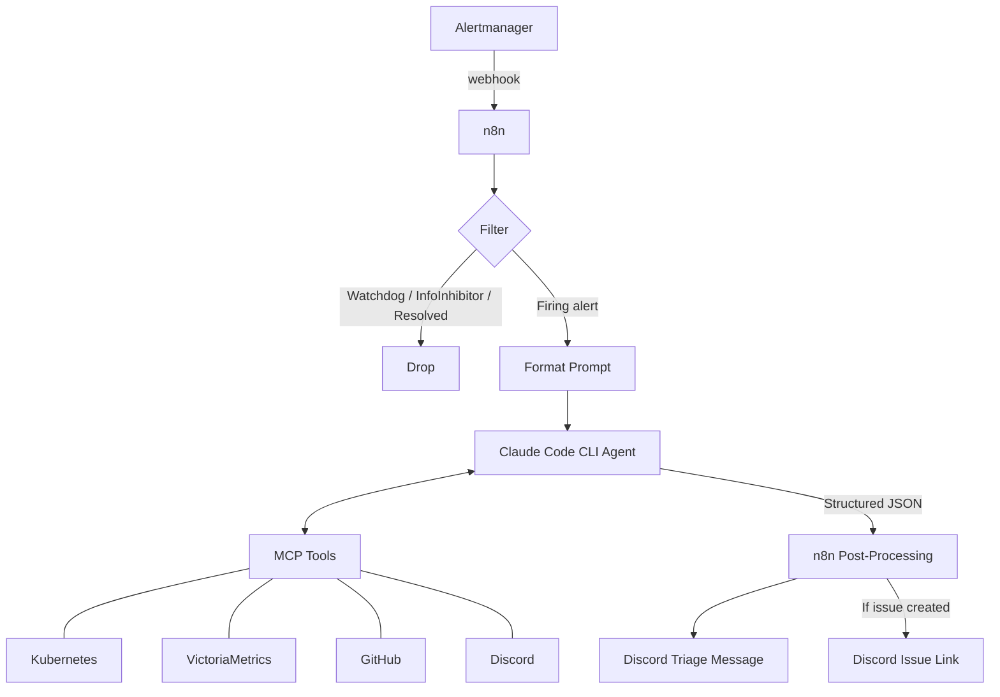
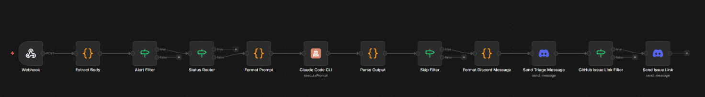

# SRE Agent for Kubernetes Workloads

Proof-of-concept: autonomous alert triage using Claude Code CLI agents orchestrated by n8n, running inside the cluster.

## How It Works

Alertmanager fires a webhook to n8n. n8n filters noise (Watchdog, InfoInhibitor, resolved alerts), formats the payload, and spawns an ephemeral Claude Code CLI agent with an SRE system prompt.
The agent investigates the alert using MCP tools (kubectl, VictoriaMetrics, GitHub, Discord), creates or updates a GitHub issue with findings, and returns structured JSON.
n8n posts the triage summary and issue link to Discord.



## Platform and Tools

| Component | Role |
| --- | --- |
| Kubernetes cluster | Workload platform, target of investigation |
| n8n | Workflow orchestration, webhook receiver |
| Claude Code CLI runners | Ephemeral agent execution (custom runner images) |
| VictoriaMetrics | Metrics backend, queried via MCP |
| kubectl MCP | Cluster inspection via MCP server |
| VictoriaMetrics MCP | Metrics queries via MCP server |
| GitHub MCP | Issue creation/updates, PR awareness |
| Discord MCP | Alert channel reads, correlation context |
| Reloader | Config/secret reload on change |
| External Secrets | Secret injection from external stores |
| Kyverno | Policy enforcement, credential injection |

## Security Model

| Layer | Detail |
| --- | --- |
| Agent isolation | Ephemeral pods in restricted namespaces |
| Network policies | Cilium CNPs scope agent egress |
| GitHub auth | GitHub App installation tokens, rotated every 30 minutes |
| Git operations | SSH transport with SSH commit signing |
| Tool control | Explicit MCP and tool allowlists per agent |
| Cluster access | Read-only RBAC, no exec/apply/delete |
| Bot identity | Dedicated GitHub bot account for agent actions |

## n8n Workflow

The workflow is named **"SRE Alertmanager Triage Webhook"** and follows this pipeline:

### Pipeline Stages



### Stage Details

| Stage | Type | Purpose |
| --- | --- | --- |
| **Webhook** | Trigger | Receives Alertmanager POST with header auth |
| **Extract Body** | Code | Extracts JSON body from webhook payload |
| **Alert Filter** | If | Drops Watchdog and InfoInhibitor alerts |
| **Status Router** | If | Routes resolved alerts away (only firing alerts reach the agent) |
| **Format Prompt** | Code | Wraps the alert payload into a prompt string |
| **Claude Code CLI** | Custom | Spawns ephemeral agent with SRE system prompt and MCP config |
| **Parse Output** | Code | Extracts JSON from agent output, with fallback for parse errors |
| **Skip Filter** | If | Drops transient/self-resolving alerts the agent flagged as skip |
| **Format Discord Message** | Code | Formats findings into Discord-length messages (max 1950 chars) |
| **Send Triage Message** | Discord | Posts triage summary to alerts channel |
| **GitHub Issue Link Filter** | If | Only proceeds if the agent created/updated a GitHub issue |
| **Send Issue Link** | Discord | Posts the tracking issue URL to Discord |

### Agent Configuration

- **Model:** `claude-opus-4-6`
- **Connection mode:** `k8sEphemeral` (pod spun up per invocation)
- **MCP config:** Mounted at `/etc/mcp/mcp.json`
- **System prompt:** [sre-triage-prompt.md](../../cluster/apps/n8n-system/n8n/assets/sre-triage-prompt.md)

### Agent Output Schema

The agent returns structured JSON that n8n uses for routing and formatting:

```json
{
  "alert_message_id": "<discord message id or null>",
  "alertname": "<string>",
  "severity": "<critical|warning|info>",
  "status": "firing",
  "skip": false,
  "maintenance_context": "<string or null>",
  "summary": "<one-line summary>",
  "findings": ["<finding 1>", "<finding 2>"],
  "probable_cause": "<root cause assessment>",
  "recommended_action": "<concrete next step>",
  "confidence": "<high|medium|low>",
  "create_issue": false,
  "github_issue_url": "<url or null>",
  "thread_name": "<alertname> triage — <HH:MM UTC>"
}
```

## Agent Investigation Flow

The SRE agent follows a structured triage process:

1. **Situational awareness** (always first)
   - Read recent Discord alerts for correlation
   - Check GitHub for active maintenance (Talos upgrades, Renovate batches)
   - Correlate: 3+ alerts within 30 minutes + active maintenance = skip issue creation

2. **Investigation checklist** (Steps 1-7)
   - Identify affected resources from alert labels
   - Check pod/workload state (CrashLoopBackOff, OOMKilled, Pending)
   - Pull namespace events
   - Verify node health
   - Check HelmRelease/Flux reconciliation status
   - Pull container logs for errors
   - Query VictoriaMetrics for trends (CPU, memory, error rates, restarts)

3. **GitHub issue management**
   - Search for existing open issue before creating a new one
   - Update existing issues with new findings
   - Skip issue creation for maintenance noise

4. **Constraints**
   - Read-only cluster operations only
   - Max 12 MCP calls for single alerts, 18 for multi-alert payloads
   - Must use at least one kubernetes MCP call AND one VictoriaMetrics call per triage

## Results


### Example GitHub Issues

| Severity | Issue | Alert |
| --- | --- | --- |
| Warning | [#838](https://github.com/anthony-spruyt/spruyt-labs/issues/838) | AlertmanagerFailedToSendAlerts -- n8n webhook auth 403 |
| Critical | [#837](https://github.com/anthony-spruyt/spruyt-labs/issues/837) | AlertmanagerClusterFailedToSendAlerts -- n8n webhook auth failure (HTTP 403) |

These issues were created autonomously by the SRE agent. Each contains a structured triage report with findings, probable cause, recommended action, and confidence level sourced from live cluster data.
