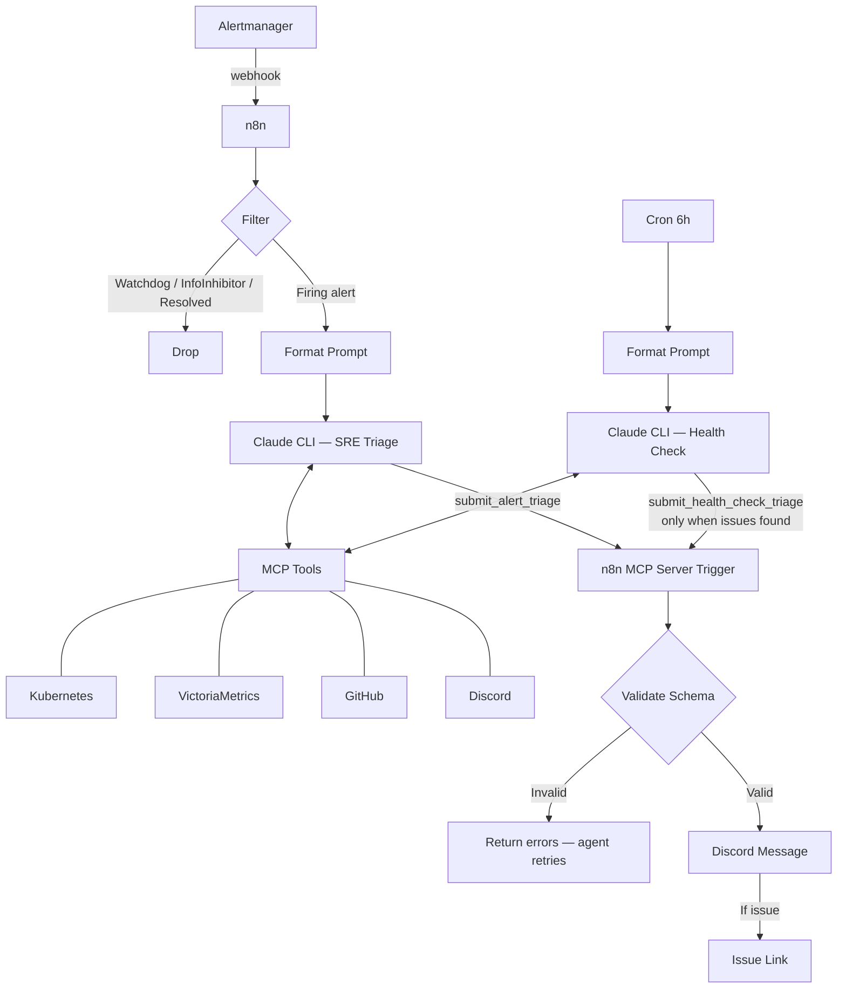
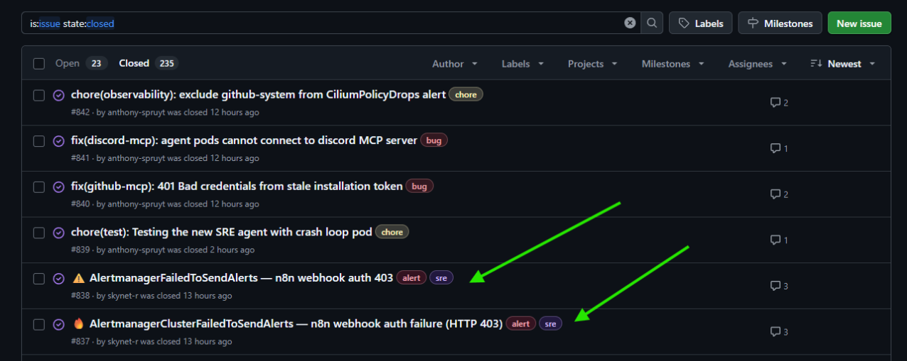

# SRE Agent for Kubernetes Workloads

Autonomous SRE operations using Claude Code CLI agents orchestrated by n8n, running inside the cluster. Two modes: reactive alert triage (Alertmanager webhook) and proactive scheduled health checks (cron). Each agent has a dedicated MCP tool (`submit_alert_triage` / `submit_health_check_triage`) for validation and Discord posting. The health check agent only calls its tool when issues are found.

## How It Works

## Platform and Tools

| Component | Role |
| --- | --- |
| Kubernetes cluster | Workload platform, target of investigation |
| n8n | Workflow orchestration, webhook receiver |
| Claude Code CLI runners | Ephemeral agent execution (custom runner images) |
| VictoriaMetrics | Metrics backend, queried via MCP |
| kubectl MCP | Cluster inspection via MCP server |
| VictoriaMetrics MCP | Metrics queries via MCP server |
| GitHub MCP | Issue creation/updates, PR awareness |
| Discord MCP | Alert channel reads, correlation context |
| Reloader | Config/secret reload on change |
| External Secrets | Secret injection from external stores |
| Kyverno | Policy enforcement, credential injection |

## Security Model

| Layer | Detail |
| --- | --- |
| Agent isolation | Ephemeral pods in restricted namespaces |
| Network policies | Cilium CNPs scope agent egress |
| GitHub auth | GitHub App installation tokens, rotated every 30 minutes |
| Git operations | SSH transport with SSH commit signing |
| Tool control | Explicit MCP and tool allowlists per agent |
| Cluster access | Read-only RBAC, no exec/apply/delete |
| Bot identity | Dedicated GitHub bot account for agent actions |

## n8n Workflow

The workflow is named **"SRE Alertmanager Triage Webhook"** and follows this pipeline:

### Pipeline Stages

#### Path A — Alert Triage

| Stage | Type | Purpose |
| --- | --- | --- |
| **Webhook** | Trigger | Receives Alertmanager POST with header auth |
| **Extract Body** | Code | Extracts JSON body from webhook payload |
| **Alert Filter** | If | Drops Watchdog and InfoInhibitor alerts |
| **Status Router** | If | Routes resolved alerts away (only firing alerts reach the agent) |
| **Format Prompt** | Code | Wraps the alert payload into a prompt string |
| **Claude Code CLI** | Custom | Spawns ephemeral agent with SRE triage prompt and MCP config |

#### Path B — Health Check

| Stage | Type | Purpose |
| --- | --- | --- |
| **Cron Trigger** | Trigger | Fires every 6 hours |
| **Format Prompt** | Code | Generates a timestamped health check prompt |
| **Claude Code CLI** | Custom | Spawns ephemeral agent with health check prompt and MCP config |

#### Path C — Result Processing (shared)

| Stage | Type | Purpose |
| --- | --- | --- |
| **MCP Server Trigger** | Trigger | Receives `submit_alert_triage` or `submit_health_check_triage` tool call from agent |
| **Validate Schema** | Code | Validates required fields, enums, trigger-specific rules |
| **Format Discord Message** | Code | Formats findings into Discord-length messages (max 1950 chars) |
| **Send Message** | Discord | Posts triage/health summary to #k8s-alerts |
| **Issue Link Filter** | If | Only proceeds if the agent created/updated a GitHub issue |
| **Send Issue Link** | Discord | Posts the tracking issue URL to Discord |

> **Note:** The health check agent only calls the MCP tool when issues are found. Healthy results produce no Discord message — the agent simply exits.

### Agent Configuration

- **Model:** `claude-opus-4-6`
- **Connection mode:** `k8sEphemeral` (pod spun up per invocation)
- **MCP config:** Mounted at `/etc/mcp/mcp.json`
- **System prompts:**
  - SRE triage: [sre-triage-prompt.md](../../cluster/apps/n8n-system/n8n/assets/sre-triage-prompt.md)
  - Health check: [health-check-prompt.md](../../cluster/apps/n8n-system/n8n/assets/health-check-prompt.md)

### MCP Tool Schemas

Each agent has a dedicated MCP tool. The `trigger` field is hardcoded by n8n — agents do not set it.

#### `submit_alert_triage`

| Field | Type | Required | Description |
| ----- | ---- | -------- | ----------- |
| `alertname` | string | yes | Name of firing alert |
| `severity` | string | yes | `"critical"`, `"warning"`, or `"info"` |
| `maintenance_context` | string | no | Active maintenance description |
| `summary` | string | yes | One-line summary |
| `findings` | string | yes | Evidence-backed findings as free-form text |
| `probable_cause` | string | no | Root cause assessment |
| `recommended_action` | string | no | Concrete next step |
| `confidence` | string | yes | `"high"`, `"medium"`, or `"low"` |
| `create_issue` | boolean | yes | Whether a GitHub issue was created |
| `github_issue_url` | string | no | URL of created or updated issue |

#### `submit_health_check_triage`

Only called when issues are found. Healthy checks produce no output.

| Field | Type | Required | Description |
| ----- | ---- | -------- | ----------- |
| `severity` | string | yes | `"critical"`, `"warning"`, or `"info"` |
| `maintenance_context` | string | no | Active maintenance description |
| `summary` | string | yes | One-line summary |
| `findings` | string | yes | Evidence-backed findings as free-form text |
| `probable_cause` | string | no | Root cause assessment |
| `recommended_action` | string | no | Concrete next step |
| `confidence` | string | yes | `"high"`, `"medium"`, or `"low"` |
| `create_issue` | boolean | yes | Whether a GitHub issue was created |
| `github_issue_url` | string | no | URL of created or updated issue |

## Agent Investigation Flow

The SRE agent follows a structured triage process:

1. **Situational awareness** (always first)
   - Read recent Discord alerts for correlation
   - Check GitHub for active maintenance (Talos upgrades, Renovate batches)
   - Correlate: 3+ alerts within 30 minutes + active maintenance = skip issue creation

2. **Investigation checklist** (Steps 1-7)
   - Identify affected resources from alert labels
   - Check pod/workload state (CrashLoopBackOff, OOMKilled, Pending)
   - Pull namespace events
   - Verify node health
   - Check HelmRelease/Flux reconciliation status
   - Pull container logs for errors
   - Query VictoriaMetrics for trends (CPU, memory, error rates, restarts)

3. **GitHub issue management**
   - Search for existing open issue before creating a new one
   - Update existing issues with new findings
   - Skip issue creation for maintenance noise

4. **Constraints**
   - Read-only cluster operations only
   - Max 12 MCP calls for single alerts, 18 for multi-alert payloads
   - Must use at least one kubernetes MCP call AND one VictoriaMetrics call per triage

## Results

### Example GitHub Issues

| Severity | Issue | Alert |
| --- | --- | --- |
| Warning | [#838](https://github.com/anthony-spruyt/spruyt-labs/issues/838) | AlertmanagerFailedToSendAlerts -- n8n webhook auth 403 |
| Critical | [#837](https://github.com/anthony-spruyt/spruyt-labs/issues/837) | AlertmanagerClusterFailedToSendAlerts -- n8n webhook auth failure (HTTP 403) |

These issues were created autonomously by the SRE agent. Each contains a structured triage report with findings, probable cause, recommended action, and confidence level sourced from live cluster data.
