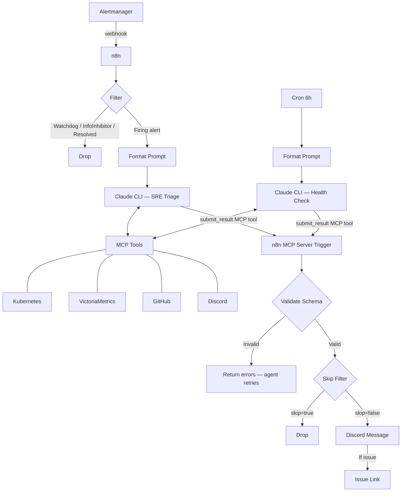

# Unified SRE Workflow Implementation Plan

> **For agentic workers:** REQUIRED SUB-SKILL: Use superpowers:subagent-driven-development (recommended) or superpowers:executing-plans to implement this plan task-by-task. Steps use checkbox (`- [ ]`) syntax for tracking.

**Goal:** Merge two n8n workflows (SRE triage + health check) into one unified workflow with MCP-based result submission and schema validation.

**Architecture:** Single n8n workflow with three triggers (Alertmanager webhook, cron, MCP Server Trigger). Agents call `submit_result` MCP tool instead of outputting raw JSON. A shared downstream path validates, formats, and posts to Discord.

**Tech Stack:** n8n (workflow), Kubernetes (CiliumNetworkPolicy, Kyverno, ConfigMap, SOPS), Claude Code CLI (agent prompts)

**Spec:** `docs/superpowers/specs/2026-04-03-unified-sre-workflow-design.md`
**Issue:** [#860](https://github.com/anthony-spruyt/spruyt-labs/issues/860)

---

## Task 1: Add CiliumNetworkPolicy — Agent Egress to n8n

**Files:**
- Modify: `cluster/apps/claude-agents-shared/base/network-policies.yaml` (append after line 133)

- [ ] **Step 1: Add the CNP**

Append the following to the end of `cluster/apps/claude-agents-shared/base/network-policies.yaml`:

```yaml
---
# yaml-language-server: $schema=https://kubernetes-schemas.pages.dev/cilium.io/ciliumnetworkpolicy_v2.json
# Allow egress to n8n MCP server
apiVersion: cilium.io/v2
kind: CiliumNetworkPolicy
metadata:
  name: allow-n8n-mcp-egress
spec:
  endpointSelector:
    matchLabels:
      managed-by: n8n-claude-code
  egress:
    - toEndpoints:
        - matchLabels:
            k8s:io.kubernetes.pod.namespace: n8n-system
            k8s:app.kubernetes.io/name: n8n
      toPorts:
        - ports:
            - port: "5678"
              protocol: TCP
```

- [ ] **Step 2: Verify pattern consistency**

Run: `grep -c "allow-.*-egress" cluster/apps/claude-agents-shared/base/network-policies.yaml`
Expected: `8` (kube-api, world, kubectl, victoriametrics, github, discord, brave-search, n8n)

- [ ] **Step 3: Commit**

```bash
git add cluster/apps/claude-agents-shared/base/network-policies.yaml
git commit -m "feat(agents): add CiliumNetworkPolicy for agent egress to n8n MCP

Ref #860"
```

---

## Task 2: Add CiliumNetworkPolicy — n8n Ingress from Agent Pods

**Files:**
- Modify: `cluster/apps/n8n-system/n8n/app/network-policies.yaml` (append new policy)

- [ ] **Step 1: Add the CNP**

Append the following to the end of `cluster/apps/n8n-system/n8n/app/network-policies.yaml`:

```yaml
---
# yaml-language-server: $schema=https://kubernetes-schemas.pages.dev/cilium.io/ciliumnetworkpolicy_v2.json
# Allow ingress from Claude agent pods (MCP submit_result)
apiVersion: cilium.io/v2
kind: CiliumNetworkPolicy
metadata:
  name: allow-claude-agent-ingress
spec:
  endpointSelector:
    matchLabels:
      app.kubernetes.io/instance: n8n
      app.kubernetes.io/name: n8n
  ingress:
    - fromEndpoints:
        - matchLabels:
            k8s:io.kubernetes.pod.namespace: claude-agents-write
            managed-by: n8n-claude-code
        - matchLabels:
            k8s:io.kubernetes.pod.namespace: claude-agents-read
            managed-by: n8n-claude-code
      toPorts:
        - ports:
            - port: "5678"
              protocol: TCP
```

Note: The `endpointSelector` uses both `app.kubernetes.io/instance: n8n` and `app.kubernetes.io/name: n8n` to match the existing pattern from `allow-traefik-ingress` and `allow-alertmanager-ingress` in the same file.

- [ ] **Step 2: Commit**

```bash
git add cluster/apps/n8n-system/n8n/app/network-policies.yaml
git commit -m "feat(n8n): add CiliumNetworkPolicy for agent MCP ingress

Ref #860"
```

---

## Task 3: Add n8n MCP Server to Agent MCP Config

**Files:**
- Modify: `cluster/apps/claude-agents-shared/base/claude-mcp-config.yaml:8-46`

- [ ] **Step 1: Add n8n entry to mcp.json**

Add the `n8n` entry after the `victoriametrics` entry (before the closing braces). The `<webhook-path-uuid>` placeholder must be replaced with the actual UUID generated when the MCP Server Trigger node is created in n8n (Task 8).

Edit `cluster/apps/claude-agents-shared/base/claude-mcp-config.yaml`, adding the `n8n` server entry:

```json
"victoriametrics": {
  "type": "http",
  "url": "http://mcp-victoriametrics.observability.svc:8080/mcp"
},
"n8n": {
  "type": "http",
  "url": "http://n8n.n8n-system.svc:5678/mcp/<webhook-path-uuid>",
  "headers": {
    "Authorization": "Bearer $${SRE_MCP_AUTH_TOKEN}"
  }
}
```

The `$${}` syntax is an n8n convention — the double `$` prevents n8n template evaluation; at runtime, the pod's environment variable `SRE_MCP_AUTH_TOKEN` is substituted.

- [ ] **Step 2: Commit**

```bash
git add cluster/apps/claude-agents-shared/base/claude-mcp-config.yaml
git commit -m "feat(agents): add n8n MCP server entry to agent config

Ref #860"
```

---

## Task 4: Add n8n MCP Auth Token to Kyverno Injection Policy

**Files:**
- Modify: `cluster/apps/kyverno/policies/app/inject-claude-agent-config.yaml:53-67` (inject-write-config env block)
- Modify: `cluster/apps/kyverno/policies/app/inject-claude-agent-config.yaml:114-128` (inject-read-config env block)

- [ ] **Step 1: Add env var to inject-write-config rule**

In `cluster/apps/kyverno/policies/app/inject-claude-agent-config.yaml`, add the `SRE_MCP_AUTH_TOKEN` env var after the `HA_API_KEY` entry in the `inject-write-config` rule (after line 67):

```yaml
                  - name: SRE_MCP_AUTH_TOKEN
                    valueFrom:
                      secretKeyRef:
                        name: mcp-credentials
                        key: sre-mcp-auth-token
```

- [ ] **Step 2: Add env var to inject-read-config rule**

Add the same env var after the `HA_API_KEY` entry in the `inject-read-config` rule (after line 128):

```yaml
                  - name: SRE_MCP_AUTH_TOKEN
                    valueFrom:
                      secretKeyRef:
                        name: mcp-credentials
                        key: sre-mcp-auth-token
```

- [ ] **Step 3: Verify both rules have the same env vars**

Run: `grep -c "SRE_MCP_AUTH_TOKEN" cluster/apps/kyverno/policies/app/inject-claude-agent-config.yaml`
Expected: `2`

- [ ] **Step 4: Commit**

```bash
git add cluster/apps/kyverno/policies/app/inject-claude-agent-config.yaml
git commit -m "feat(kyverno): inject SRE_MCP_AUTH_TOKEN into agent pods

Ref #860"
```

---

## Task 5: Add n8n MCP Auth Token to SOPS Credentials

**Files:**
- Modify: `cluster/apps/claude-agents-shared/base/mcp-credentials.sops.yaml`

This task requires the user to manually edit the SOPS-encrypted file.

- [ ] **Step 1: User adds the secret**

The user runs:

```bash
sops cluster/apps/claude-agents-shared/base/mcp-credentials.sops.yaml
```

And adds a new key:

```yaml
stringData:
  context7-api-key: "existing-key"
  ha-api-key: "existing-key"
  sre-mcp-auth-token: "<token>"  # Must match the n8n headerAuth credential value
```

The token value must match the value configured in the n8n `SRE Agent MCP auth` headerAuth credential (created in Task 8).

- [ ] **Step 2: Commit**

```bash
git add cluster/apps/claude-agents-shared/base/mcp-credentials.sops.yaml
git commit -m "feat(agents): add n8n MCP auth token to SOPS credentials

Ref #860"
```

---

## Task 6: Update SRE Triage System Prompt

**Files:**
- Modify: `cluster/apps/n8n-system/n8n/assets/sre-triage-prompt.md`

The system prompt embedded in the n8n Claude CLI node must also be updated, but that is done in the n8n UI (Task 8). This task updates the reference doc in git.

- [ ] **Step 1: Update the MCP Tool Reference table**

Add the `submit_result` tool to the MCP Tool Reference table in `cluster/apps/n8n-system/n8n/assets/sre-triage-prompt.md`:

```markdown
| Submit triage result | `mcp__sre__submit_result` |
```

- [ ] **Step 2: Replace the Output section**

Replace the entire `## Output — Structured JSON` section (lines 198-231 of the current file) with:

```markdown
## Output — MCP Tool Submission

**CRITICAL: You MUST call `mcp__sre__submit_result` to submit your triage result. Do NOT output raw JSON. The tool validates your submission and returns success or error details. If validation fails, fix the payload and re-call (max 3 attempts).**

Call `mcp__sre__submit_result` with the following fields:

| Field | Type | Required | Description |
|-------|------|----------|-------------|
| `trigger` | string | yes | Always `"alert"` for SRE triage |
| `skip` | boolean | yes | `true` for transient/self-resolving alerts |
| `alert_message_id` | string | yes | Discord message ID of matching Alertmanager notification, or empty string if not found |
| `alertname` | string | yes | Name of the firing alert |
| `severity` | string | yes | `"critical"`, `"warning"`, or `"info"` |
| `maintenance_context` | string | no | Active maintenance description, or empty string |
| `summary` | string | yes | One-line summary |
| `findings` | string | yes | Evidence-backed findings as free-form text |
| `probable_cause` | string | no | Root cause assessment |
| `recommended_action` | string | no | Concrete next step |
| `confidence` | string | yes | `"high"`, `"medium"`, or `"low"` |
| `create_issue` | boolean | yes | `true` if a new GitHub issue was created |
| `github_issue_url` | string | no | URL of created or updated issue, or empty string |

If the tool returns `{ "valid": false, "errors": [...] }`, fix the listed errors and re-call. Do not output anything else after a successful submission.
```

- [ ] **Step 3: Remove `thread_name` references**

Search for and remove any remaining `thread_name` references in the file.

- [ ] **Step 4: Remove `status` field references**

Search for and remove the `"status": "firing"` entry from any schema examples and field notes. The Status Router filters resolved alerts upstream.

- [ ] **Step 5: Commit**

```bash
git add cluster/apps/n8n-system/n8n/assets/sre-triage-prompt.md
git commit -m "feat(agents): update SRE triage prompt for MCP submit_result

Ref #860"
```

---

## Task 7: Update Health Check System Prompt

**Files:**
- Modify: `cluster/apps/n8n-system/n8n/assets/health-check-prompt.md`

Same as Task 6 — update the reference doc. The n8n-embedded prompt is updated in Task 8.

- [ ] **Step 1: Update the MCP Tool Reference table**

Add the `submit_result` tool to the MCP Tool Reference table:

```markdown
| Submit health check result | `mcp__sre__submit_result` |
```

- [ ] **Step 2: Replace the Output section**

Replace the entire `## Output — Structured JSON` section (lines 186-239 of the current file) with:

```markdown
## Output — MCP Tool Submission

**CRITICAL: You MUST call `mcp__sre__submit_result` to submit your health check result. Do NOT output raw JSON. The tool validates your submission and returns success or error details. If validation fails, fix the payload and re-call (max 3 attempts).**

Call `mcp__sre__submit_result` with the following fields:

| Field | Type | Required | Description |
|-------|------|----------|-------------|
| `trigger` | string | yes | Always `"health-check"` |
| `healthy` | boolean | yes | `true` if all GitOps resources reconciled and certs valid |
| `skip` | boolean | yes | `true` when healthy or all issues are expected maintenance noise |
| `maintenance_context` | string | no | Active maintenance description, or empty string |
| `summary` | string | yes | One-line summary |
| `findings` | string | yes | Evidence-backed findings as free-form text. Empty string when healthy. |
| `probable_cause` | string | no | Root cause assessment, or empty string if healthy |
| `recommended_action` | string | no | Concrete next step, or empty string if healthy |
| `confidence` | string | yes | `"high"`, `"medium"`, or `"low"` |
| `create_issue` | boolean | yes | `true` if a new GitHub issue was created |
| `github_issue_url` | string | no | URL of created or updated issue, or empty string |

If the tool returns `{ "valid": false, "errors": [...] }`, fix the listed errors and re-call. Do not output anything else after a successful submission.
```

- [ ] **Step 3: Remove `thread_name` references**

Search for and remove any remaining `thread_name` references in the file.

- [ ] **Step 4: Commit**

```bash
git add cluster/apps/n8n-system/n8n/assets/health-check-prompt.md
git commit -m "feat(agents): update health check prompt for MCP submit_result

Ref #860"
```

---

## Task 8: Build Unified n8n Workflow in the UI

**Files:**
- n8n workflow (manual, via n8n web UI at `https://n8n.${EXTERNAL_DOMAIN}`)

This task is done entirely in the n8n UI. No git changes.

- [ ] **Step 1: Create headerAuth credential**

In n8n Settings > Credentials, create a new `Header Auth` credential:
- **Name:** `SRE Agent MCP auth`
- **Header Name:** `Authorization`
- **Header Value:** `Bearer <token>` (must match the value in `mcp-credentials.sops.yaml` from Task 5)

- [ ] **Step 2: Create the unified workflow**

Create a new workflow named `Unified SRE Workflow`. Add the following trigger paths:

**Path A — Alert Triage (copy from existing SRE workflow):**
- Webhook node (POST, headerAuth with existing `Alertmanager webhook for SRE agent` credential)
- Extract Body (Code node — same as existing)
- Alert Filter (If node — Watchdog/InfoInhibitor filter, same as existing)
- Status Router (If node — resolved filter, same as existing)
- Format Prompt (Code node — same as existing)
- Claude Code CLI (same settings: k8sEphemeral, opus-4-6, `/etc/mcp/mcp.json`, SRE triage system prompt with MCP submit_result instructions from Task 6)

**Path B — Health Check (copy from existing health check workflow):**
- Schedule Trigger (6h interval, same as existing)
- Format Prompt (Code node — same as existing)
- Claude Code CLI (same settings: k8sEphemeral, opus-4-6, `/etc/mcp/mcp.json`, health check system prompt with MCP submit_result instructions from Task 7)

**Path C — MCP Server Trigger + downstream:**
- MCP Server Trigger node (`@n8n/n8n-nodes-langchain.mcpTrigger`, headerAuth with `SRE Agent MCP auth` credential)
- `submit_result` toolWorkflow connected via `ai_tool` connection to the MCP trigger
- executeWorkflowTrigger (self-referencing, receives payload from toolWorkflow)
- Validate Schema (Code node — see step 3)
- Skip Filter (If node — `skip === false`)
- Format Discord Message (Code node — see step 4)
- Send to #k8s-alerts (Discord node — same config as existing)
- GitHub Issue Link Filter (If node — `github_issue_url !== ""`)
- Send Issue Link (Discord node — same config as existing)

- [ ] **Step 3: Implement Validate Schema Code node**

```js
const d = $input.first().json;
const errors = [];

// Required fields
const required = ['trigger', 'skip', 'summary', 'findings', 'confidence', 'create_issue'];
for (const field of required) {
  if (d[field] === undefined || d[field] === null) {
    errors.push(`missing required field: ${field}`);
  }
}

// trigger enum
if (d.trigger && !['alert', 'health-check'].includes(d.trigger)) {
  errors.push('trigger must be "alert" or "health-check"');
}

// confidence enum
if (d.confidence && !['high', 'medium', 'low'].includes(d.confidence)) {
  errors.push('confidence must be "high", "medium", or "low"');
}

// findings must be non-empty string
if (typeof d.findings === 'string' && d.findings.trim() === '') {
  errors.push('findings must be a non-empty string');
}

// Alert-specific validation
if (d.trigger === 'alert') {
  if (!d.alertname) errors.push('alertname is required for alert trigger');
  if (!d.severity) errors.push('severity is required for alert trigger');
  if (d.severity && !['critical', 'warning', 'info'].includes(d.severity)) {
    errors.push('severity must be "critical", "warning", or "info"');
  }
}

// Health-check-specific validation
if (d.trigger === 'health-check') {
  if (typeof d.healthy !== 'boolean') {
    errors.push('healthy must be a boolean for health-check trigger');
  }
}

if (errors.length > 0) {
  return [{ json: { valid: false, errors } }];
}

return [{ json: { valid: true, ...d } }];
```

- [ ] **Step 4: Implement Format Discord Message Code node**

```js
const d = $input.first().json;
const header = d.trigger === 'alert' ? 'What fired' : 'Summary';
let msg = '';
if (d.maintenance_context) {
  msg += `**Context:**\n- ${d.maintenance_context}\n\n`;
}
msg += `**${header}:**\n- ${d.summary}\n\n`;
msg += `**Investigation:**\n${d.findings}\n\n`;
if (d.probable_cause) {
  msg += `**Probable cause:**\n${d.probable_cause}\n\n`;
}
if (d.recommended_action) {
  msg += `**Recommended action:**\n${d.recommended_action}\n\n`;
}
msg += `**Confidence:** ${d.confidence}`;
const MAX = 1950;
const messages = [];
let current = '';
for (const line of msg.split('\n')) {
  if (current.length + line.length + 1 > MAX && current.length > 0) {
    messages.push(current.trimEnd());
    current = '';
  }
  current += line + '\n';
}
if (current.trim()) {
  messages.push(current.trimEnd());
}
return messages.map(m => ({ json: { ...d, discord_message: m } }));
```

- [ ] **Step 5: Wire validation routing**

After the Validate Schema node, add an If node to check `valid === true`:
- **True path:** continues to Skip Filter
- **False path:** returns the `{ valid: false, errors: [...] }` response back through the toolWorkflow to the agent

- [ ] **Step 6: Update system prompts in Claude CLI nodes**

Copy the updated prompt content from the reference docs (Tasks 6 and 7) into the `systemPrompt` field of each Claude Code CLI node. The prompts must include:
- The `submit_result` MCP tool in the MCP Tool Reference table
- The new Output section with MCP submission instructions
- No `thread_name` or `status` references

- [ ] **Step 7: Note the MCP Server Trigger webhook path UUID**

After creating the MCP Server Trigger node, copy its webhook path UUID. This UUID is needed to complete the MCP config URL in Task 3 (`http://n8n.n8n-system.svc:5678/mcp/<webhook-path-uuid>`).

- [ ] **Step 8: Test with webhook-test mode**

Activate the workflow. Use n8n's test mode to verify:
1. Path A: Send a test Alertmanager webhook — verify the agent spawns and calls `submit_result`
2. Path B: Manually trigger the cron — verify the agent spawns and calls `submit_result`
3. Path C: Verify validation errors are returned correctly (test with a malformed payload)
4. Verify Discord messages arrive in #k8s-alerts

- [ ] **Step 9: Deactivate old workflows**

Once the unified workflow is confirmed working, deactivate (do not delete) the two old workflows:
- `SRE Alertmanager Triage Webhook`
- The health check workflow

---

## Task 9: Update MCP Config with Actual Webhook UUID

**Files:**
- Modify: `cluster/apps/claude-agents-shared/base/claude-mcp-config.yaml`

This task depends on Task 8 Step 7 — the webhook path UUID is only known after creating the MCP Server Trigger node in n8n.

- [ ] **Step 1: Replace the placeholder UUID**

In `cluster/apps/claude-agents-shared/base/claude-mcp-config.yaml`, replace `<webhook-path-uuid>` in the n8n MCP server URL with the actual UUID from Task 8.

- [ ] **Step 2: Commit**

```bash
git add cluster/apps/claude-agents-shared/base/claude-mcp-config.yaml
git commit -m "feat(agents): set n8n MCP server webhook UUID

Ref #860"
```

---

## Task 10: Update claude-agents-shared README

**Files:**
- Modify: `cluster/apps/claude-agents-shared/README.md`

- [ ] **Step 1: Add n8n to the Structure section**

No change needed — the README's structure section lists base files generically. The new MCP entry is in `claude-mcp-config.yaml` which is already listed.

- [ ] **Step 2: Add n8n example to "Adding a New MCP Server" section**

The README already has examples for no-auth and API-key servers. The n8n entry uses bearer token auth which is a variation of the API-key pattern. No new section needed — the existing `headers` example covers this pattern.

Verify the README's example still matches. If the bearer token pattern differs from the existing `Authorization: Bearer $${}` example, update accordingly. Otherwise no change.

- [ ] **Step 3: Add n8n to the credential rotation table**

Add a row to the "Credential Rotation" table:

```markdown
| n8n MCP auth token | Manual: `sops cluster/apps/claude-agents-shared/base/mcp-credentials.sops.yaml` |
```

- [ ] **Step 4: Commit**

```bash
git add cluster/apps/claude-agents-shared/README.md
git commit -m "docs(agents): add n8n MCP server to shared README

Ref #860"
```

---

## Task 11: Update n8n README

**Files:**
- Modify: `cluster/apps/n8n-system/n8n/README.md`

- [ ] **Step 1: Add Unified SRE Workflow section**

Add a new section after "Webhook Bypass" (around line 134) describing the unified workflow:

```markdown
## Unified SRE Workflow

n8n hosts a unified SRE workflow that combines alert triage and scheduled health checks. Both agent types submit results via an MCP Server Trigger (`submit_result` tool) which validates the schema and posts to Discord.

### Triggers

| Trigger | Source | Agent |
|---------|--------|-------|
| Alertmanager Webhook | Firing alerts (filtered: Watchdog, InfoInhibitor, resolved) | SRE triage |
| Cron (6h) | Scheduled | Health check |
| MCP Server Trigger | Agent `submit_result` call | Result processing |

### Authentication

| Endpoint | Credential |
|----------|------------|
| Alertmanager Webhook | `Alertmanager webhook for SRE agent` (headerAuth) |
| MCP Server Trigger | `SRE Agent MCP auth` (headerAuth) |

### Agent Configuration

- **Model:** `claude-opus-4-6`
- **Connection mode:** `k8sEphemeral`
- **MCP config:** `/etc/mcp/mcp.json` (includes n8n MCP server for `submit_result`)

See `docs/sre-automation/sre.md` for the full architecture and investigation flow.
```

- [ ] **Step 2: Commit**

```bash
git add cluster/apps/n8n-system/n8n/README.md
git commit -m "docs(n8n): add unified SRE workflow documentation

Ref #860"
```

---

## Task 12: Update SRE Automation Documentation

**Files:**
- Modify: `docs/sre-automation/sre.md`

- [ ] **Step 1: Update the opening paragraph**

Replace the first paragraph (line 3) with:

```markdown
Autonomous SRE operations using Claude Code CLI agents orchestrated by n8n, running inside the cluster. Two modes: reactive alert triage (Alertmanager webhook) and proactive scheduled health checks (cron). Both agents submit structured results via an MCP tool (`submit_result`) for validation and Discord posting.
```

- [ ] **Step 2: Update the mermaid diagram**

Replace the existing mermaid diagram (lines 12-26) with:

````markdown

````

- [ ] **Step 3: Update the Pipeline Stages table**

Replace the existing "Stage Details" table with:

```markdown
### Path A — Alert Triage

| Stage | Type | Purpose |
| --- | --- | --- |
| **Webhook** | Trigger | Receives Alertmanager POST with header auth |
| **Extract Body** | Code | Extracts JSON body from webhook payload |
| **Alert Filter** | If | Drops Watchdog and InfoInhibitor alerts |
| **Status Router** | If | Routes resolved alerts away (only firing alerts reach the agent) |
| **Format Prompt** | Code | Wraps the alert payload into a prompt string |
| **Claude Code CLI** | Custom | Spawns ephemeral agent with SRE triage prompt and MCP config |

### Path B — Health Check

| Stage | Type | Purpose |
| --- | --- | --- |
| **Cron Trigger** | Trigger | Fires every 6 hours |
| **Format Prompt** | Code | Generates a timestamped health check prompt |
| **Claude Code CLI** | Custom | Spawns ephemeral agent with health check prompt and MCP config |

### Path C — Result Processing (shared)

| Stage | Type | Purpose |
| --- | --- | --- |
| **MCP Server Trigger** | Trigger | Receives `submit_result` tool call from agent |
| **Validate Schema** | Code | Validates required fields, enums, trigger-specific rules |
| **Skip Filter** | If | Drops results flagged as skip (transient/healthy) |
| **Format Discord Message** | Code | Formats findings into Discord-length messages (max 1950 chars) |
| **Send Message** | Discord | Posts triage/health summary to #k8s-alerts |
| **Issue Link Filter** | If | Only proceeds if the agent created/updated a GitHub issue |
| **Send Issue Link** | Discord | Posts the tracking issue URL to Discord |
```

- [ ] **Step 4: Update the Agent Output Schema section**

Replace the existing schema JSON block and field descriptions with:

```markdown
### Unified Schema

Both agents submit through the same `submit_result` MCP tool:

| Field | Type | Required | Description |
|-------|------|----------|-------------|
| `trigger` | string | yes | `"alert"` or `"health-check"` |
| `healthy` | boolean | health-check only | Cluster health status |
| `skip` | boolean | yes | Skip Discord posting |
| `alert_message_id` | string | alert only | Discord message ID of Alertmanager notification |
| `alertname` | string | alert only | Name of firing alert |
| `severity` | string | alert only | `"critical"`, `"warning"`, or `"info"` |
| `maintenance_context` | string | no | Active maintenance description |
| `summary` | string | yes | One-line summary |
| `findings` | string | yes | Evidence-backed findings as free-form text |
| `probable_cause` | string | no | Root cause assessment |
| `recommended_action` | string | no | Concrete next step |
| `confidence` | string | yes | `"high"`, `"medium"`, or `"low"` |
| `create_issue` | boolean | yes | Whether a GitHub issue was created |
| `github_issue_url` | string | no | URL of created or updated issue |
```

- [ ] **Step 5: Commit**

```bash
git add docs/sre-automation/sre.md
git commit -m "docs(sre): update for unified workflow with MCP submit_result

Ref #860"
```

---

## Task 13: Final Verification

- [ ] **Step 1: Verify all files are committed**

Run: `git status`
Expected: clean working tree (all changes committed)

- [ ] **Step 2: Verify YAML syntax**

Run: `yamllint cluster/apps/claude-agents-shared/base/network-policies.yaml cluster/apps/n8n-system/n8n/app/network-policies.yaml cluster/apps/kyverno/policies/app/inject-claude-agent-config.yaml`
Expected: no errors

- [ ] **Step 3: Verify kustomize build**

Run: `kubectl kustomize cluster/apps/claude-agents-shared/base/`
Expected: successful build including the new `allow-n8n-mcp-egress` CNP

- [ ] **Step 4: Run qa-validator**

Run the qa-validator agent to validate all changes before the final push.

- [ ] **Step 5: Summarize completion**

All infrastructure changes are committed. The n8n workflow is built in the UI. After the user pushes:
1. Flux reconciles the CNPs, MCP config, Kyverno policy, and SOPS credentials
2. The unified workflow is already active in n8n
3. Run cluster-validator to verify deployment
