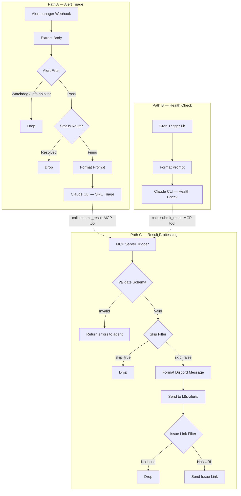

# Unified SRE Workflow with MCP Validation

**Issue:** [#860](https://github.com/anthony-spruyt/spruyt-labs/issues/860)
**Date:** 2026-04-03

## Problem

Two separate n8n workflows (SRE triage and scheduled health check) duplicate downstream
nodes: Parse Output, Skip Filter, Format Discord Message, Send to Discord, GitHub Issue
Link Filter, Send Issue Link. Both agents output raw JSON to stdout, which n8n parses
with brittle regex extraction. There is no agent-side validation — if the JSON is
malformed, the parse fallback produces a degraded result with no opportunity for the
agent to fix it.

## Solution

Merge both workflows into a single unified n8n workflow with three triggers. Replace stdout JSON output with an MCP `submit_result` tool that validates the agent's payload before handoff. Both agents submit through the same tool with a unified superset schema.

## Architecture

```text
Single n8n Workflow — "Unified SRE Workflow"

Path A: Alertmanager Webhook (headerAuth)
  → Extract Body → Alert Filter (Watchdog/InfoInhibitor)
  → Status Router (drop resolved) → Format Prompt
  → Claude CLI (SRE triage prompt, SRE MCP server configured)
  → [execution ends — agent submits via MCP]

Path B: Cron (6h interval)
  → Format Prompt
  → Claude CLI (health check prompt, SRE MCP server configured)
  → [execution ends — agent submits via MCP]

Path C: MCP Server Trigger (submit_result, headerAuth)
  → Validate Schema (Code node)
  → Skip Filter → Format Discord Message
  → Send to #k8s-alerts → Issue Link Filter → Send Issue Link
```

Paths A and B launch the agent. The agent calls `submit_result` during execution, which triggers Path C as a separate n8n execution. Path C validates, processes, and posts to Discord.



## MCP Server Trigger

**Node type:** `@n8n/n8n-nodes-langchain.mcpTrigger`
**Auth:** `headerAuth` (credential name: `SRE Agent MCP auth`)

### submit_result Tool

**Node type:** `@n8n/n8n-nodes-langchain.toolWorkflow`
**Name:** `submit_result`
**Description:** Submit SRE triage or health check result. Validates the schema and sends to Discord. Returns validation result — if error, fix the payload and retry (max 3 attempts).
**Workflow:** Self-referencing (`$workflow.id`) via `executeWorkflowTrigger`

### Node Topology

The MCP Server Trigger exposes tools to external MCP clients. Each tool is a `toolWorkflow` node connected to the trigger via `ai_tool` connections. When the agent calls `submit_result`:

1. Agent connects to n8n's MCP endpoint (HTTP transport)
2. `mcpTrigger` node receives the tool call
3. `toolWorkflow` node (`submit_result`) executes the same workflow via `executeWorkflowTrigger`
4. `executeWorkflowTrigger` receives the payload and routes to Validate Schema → downstream nodes
5. The tool's return value (valid/invalid) flows back through the `toolWorkflow` → `mcpTrigger` → agent

```text
Agent ──MCP call──→ mcpTrigger
                      ↓ (ai_tool connection)
                    toolWorkflow (submit_result)
                      ↓ (executes $workflow.id)
                    executeWorkflowTrigger
                      ↓
                    Validate Schema → Skip Filter → Discord → ...
                      ↓ (return value)
                    toolWorkflow ──→ mcpTrigger ──→ Agent
```

## Unified Schema

Both agents submit through the same tool with a superset schema. Alert-specific fields are nullable.

### Fields Removed from Current Schemas

- **`thread_name`** — Dead field. Neither workflow's Discord send nodes use thread parameters. Discord threading is not in use; the field was never consumed downstream.
- **`status`** — Always hardcoded to `"firing"` in the SRE schema. The Status Router node filters resolved alerts upstream of the agent, so the agent never sees non-firing alerts. No downstream node reads this field.

| Field | Type | Required | Description |
| ----- | ---- | -------- | ----------- |
| `trigger` | string | yes | `"alert"` or `"health-check"` |
| `healthy` | boolean | no | Cluster health status. Required for health checks, null for alerts. |
| `skip` | boolean | yes | If `true`, n8n skips Discord posting. |
| `alert_message_id` | string | no | Discord message ID of matching Alertmanager notification. Alerts only. |
| `alertname` | string | no | Name of firing alert. Required for alerts. |
| `severity` | string | no | `"critical"`, `"warning"`, or `"info"`. Required for alerts. |
| `maintenance_context` | string | no | Active maintenance description, or null. |
| `summary` | string | yes | One-line summary of findings. |
| `findings` | string | yes | Evidence-backed findings as free-form text. Agent may use newlines or bullet formatting. |
| `probable_cause` | string | no | Root cause assessment, or null if healthy. |
| `recommended_action` | string | no | Concrete next step, or null if healthy. |
| `confidence` | string | yes | `"high"`, `"medium"`, or `"low"`. |
| `create_issue` | boolean | yes | Whether a new GitHub issue was created. |
| `github_issue_url` | string | no | URL of created or updated issue, or null. |


### Validation Rules

The Validate Schema Code node checks:

1. Required fields exist: `trigger`, `skip`, `summary`, `findings`, `confidence`, `create_issue`
2. `trigger` is `"alert"` or `"health-check"`
3. `confidence` is `"high"`, `"medium"`, or `"low"`
4. `findings` is a non-empty string
5. If `trigger === "alert"`: `alertname` and `severity` are present; `severity` is `"critical"`, `"warning"`, or `"info"`
6. If `trigger === "health-check"`: `healthy` is present and boolean

On failure, return error details to the agent:

```json
{
  "valid": false,
  "errors": ["missing required field: confidence", "severity must be critical|warning|info"]
}
```

On success, parsed data flows to downstream nodes and the tool returns:

```json
{
  "valid": true
}
```

## Format Discord Message

Unified formatter checks `trigger` to pick the appropriate header:

```js
const header = d.trigger === 'alert' ? 'What fired' : 'Summary';
```

All other formatting logic is shared (maintenance context, findings list, probable cause, recommended action, confidence, 1950-char chunking).

## Infrastructure Changes

### 1. MCP Config — `cluster/apps/claude-agents-shared/base/claude-mcp-config.yaml`

Add SRE MCP server entry:

```json
"sre": {
  "type": "http",
  "url": "http://n8n.n8n-system.svc:5678/mcp/<webhook-path-uuid>",
  "headers": {
    "Authorization": "Bearer $${SRE_MCP_AUTH_TOKEN}"
  }
}
```

### 2. Credentials — `cluster/apps/claude-agents-shared/base/mcp-credentials.sops.yaml`

Add key:

```yaml
stringData:
  sre-mcp-auth-token: "<token matching n8n headerAuth credential>"
```

### 3. Kyverno Policy — `cluster/apps/kyverno/policies/app/inject-claude-agent-config.yaml`

Add env var to both `inject-write-config` and `inject-read-config` rules:

```yaml
- name: SRE_MCP_AUTH_TOKEN
  valueFrom:
    secretKeyRef:
      name: mcp-credentials
      key: sre-mcp-auth-token
```

### 4. CiliumNetworkPolicy — Agent Egress

Add to `cluster/apps/claude-agents-shared/base/network-policies.yaml`:

```yaml
---
apiVersion: cilium.io/v2
kind: CiliumNetworkPolicy
metadata:
  name: allow-n8n-mcp-egress
spec:
  endpointSelector:
    matchLabels:
      managed-by: n8n-claude-code
  egress:
    - toEndpoints:
        - matchLabels:
            k8s:io.kubernetes.pod.namespace: n8n-system
            k8s:app.kubernetes.io/name: n8n
      toPorts:
        - ports:
            - port: "5678"
              protocol: TCP
```

### 5. CiliumNetworkPolicy — n8n Ingress

Add a new `CiliumNetworkPolicy` named `allow-claude-agent-ingress` to `cluster/apps/n8n-system/n8n/app/network-policies.yaml` (one policy per source, matching existing pattern of `allow-traefik-ingress`, `allow-alertmanager-ingress`):

```yaml
---
apiVersion: cilium.io/v2
kind: CiliumNetworkPolicy
metadata:
  name: allow-claude-agent-ingress
spec:
  endpointSelector:
    matchLabels:
      app.kubernetes.io/name: n8n
  ingress:
    - fromEndpoints:
        - matchLabels:
            k8s:io.kubernetes.pod.namespace: claude-agents-write
            managed-by: n8n-claude-code
        - matchLabels:
            k8s:io.kubernetes.pod.namespace: claude-agents-read
            managed-by: n8n-claude-code
      toPorts:
        - ports:
            - port: "5678"
              protocol: TCP
```

## Prompt Updates

Both system prompts (embedded in Claude CLI node config) are rewritten:

- Remove all "output raw JSON" instructions and schema documentation
- Remove `thread_name` field references
- Add instructions to call `submit_result` MCP tool with the unified schema
- Add MCP tool reference entry for `submit_result`
- Document which fields are required per trigger type
- Add retry instructions: if `submit_result` returns validation errors, fix the payload and re-call (max 3 attempts)

The `assets/` markdown files are updated as reference documentation to match.

## Documentation Updates

| File | Changes |
| ---- | ------- |
| `docs/sre-automation/sre.md` | Rewrite for unified workflow: update mermaid diagram, add health check path, document MCP submit_result pattern, remove Parse Output stage, update schema (drop `thread_name`/`status`, add `trigger`/`healthy`), update stage details table |
| `cluster/apps/claude-agents-shared/README.md` | Add SRE MCP server to reference tables and "Adding a New MCP Server" examples |
| `cluster/apps/n8n-system/n8n/README.md` | Document unified workflow architecture and MCP Server Trigger |
| `cluster/apps/n8n-system/n8n/assets/sre-triage-prompt.md` | Update reference doc to match new system prompt |
| `cluster/apps/n8n-system/n8n/assets/health-check-prompt.md` | Update reference doc to match new system prompt |

## Nodes Removed

From the two existing workflows, the following duplicated nodes are eliminated:

- 2x Parse Output (regex JSON extraction)
- 2x Skip Filter
- 2x Format Discord Message
- 2x Send Discord Message (Send Triage Message / Send Health Report)
- 2x GitHub Issue Link Filter
- 2x Send Issue Link

Replaced by one instance of each in Path C, plus the MCP Server Trigger and Validate Schema nodes.

## Scope Exclusions

- No changes to the agent's MCP tool access (kubectl, VictoriaMetrics, GitHub, Discord remain as-is)
- No changes to agent RBAC or pod security
- No changes to the Alertmanager webhook configuration
- No changes to the Discord bot or channel setup
- The n8n workflow JSON is authored manually in the n8n UI, not managed by Flux/GitOps
